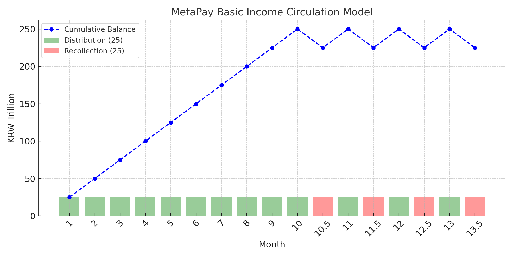

# MetaPayP2P — Web3 Basic Income Simulation with AI & Peer Transfers

*(Powered by OpenAI API & Alith AI)*

---

## 🌍 Project Overview

MetaPayP2P is a Web3-based simulation of a circulating basic income system designed by Gyuha Yoon.  
Its purpose is to demonstrate a sustainable economic model where income is continuously circulated rather than endlessly printed.

- ✅ National Wallet distributes funds equally to 10 citizen wallets over 10 distribution rounds.  
- ✅ After every 10 distributions, 10% of citizen balances are recollected.  
- ✅ This Distribute → Recollect → Repeat cycle ensures sustainability.  
- ✅ Citizens are free to engage in peer-to-peer (P2P) transfers anytime, simulating a real economic ecosystem.  
- ✅ Alith AI monitors economic activity and warns of imbalances or risks.  
- ✅ OpenAI API powers AI-generated behavior logic and intelligent alerts.  

---

## 💡 Why MetaPay Matters

- 🔄 Demonstrates a tax-free, sustainable circulating basic income model.
- 🏛️ Offers a scalable concept for real-world pilot programs.
- 🤖 Integrates AI-driven behavior analysis for responsible financial interaction.
- 💬 Promotes transparent peer-to-peer economic activities on blockchain.

---

## 💹 MetaPay Circulation Model Overview

The chart below illustrates the MetaPay Basic Income Circulation Model:



- 🟩 Monthly distribution (green)  
- 🟥 Recollection every 10 rounds (red)  
- 🔵 Cumulative circulating balance (blue line)  

> This graph demonstrates how the balance grows with 10 cycles of distribution and stabilizes through periodic recollection, enabling a sustainable circulation model of basic income.

**Important:**  
In the MetaPay simulation, the national wallet must follow a strict cycle of **10 rounds of distribution followed by 1 round of recollection**, repeated continuously.  

If after 10 distributions and 1 recollection the **National Wallet balance remains at 4999**, the system requires **manual adjustment** by transferring **1 unit** from a **user wallet holding an odd amount of MetaPay** back to the National Wallet.  

This allows the next distribution to proceed normally.

> In real-life pilot projects, population increase or decrease may require manual adjustment accounts or automated balancing bots to stabilize the circulation system.

---

## 🏛️ Real-World Pilot Project Consideration

MetaPay’s model suggests implementing either:

- ✅ **Manual Adjustment Accounts** for population fluctuations  
- ✅ **Automated Balancing Bots** integrated with on-chain monitoring tools  

This allows seamless adaptation even in dynamic economic environments.

---

## 🛣️ Roadmap

- ✅ Phase 1: Simulation & AI Behavior Analysis (Completed)
- 🔄 Phase 2: Automated Balancing Mechanism (Planned)
- 🏛️ Phase 3: Institutional Pilot Testing with Governments/NGOs (Planned)

---

## 👥 Want to Join as a Tester?

We are onboarding testers for the next round of MetaPayP2P simulation.  
📧 Contact us at anioia33@gmail.com  

---

> “MetaPay is not just a simulation — it’s a vision for a freer, sustainable economy.”  
> — Gyuha Yoon, Creator of MetaPay  

---

## 🔧 Tech Stack

| Layer      | Technology                  |
|------------|------------------------------|
| Smart Contract | Solidity (Ethereum Sepolia Testnet) |
| Frontend  | React (Vite)                 |
| Backend   | Node.js + Express            |
| Blockchain| Ethereum Sepolia             |
| AI Integration | OpenAI API (analyze.js / server.js) |
| Wallet    | MetaMask                     |

---

## 📁 Project Structure

```
vite-project/
├── src/
│   ├── App.jsx              # Frontend Logic
│   └── abi.js               # Contract ABI & Address
├── ai-server/
│   ├── server.js            # OpenAI API Call Handler
│   └── analyze.js           # AI Logic
├── contracts/
│   └── MetaPayP2P_Complete.sol   # Solidity Smart Contract
├── public/
│   └── metapay_full_flow_chart.png
├── LICENSE
└── README.md
```
---

## 🆕 July 2025 Update Summary

- ✅ **AI Analysis Integrated**
  - Analyzes economic behavior across users, companies, and the national wallet.
  - Alerts generated by OpenAI API are shown in the top-right "AI Analysis Alerts" box.

- ✅ **National Wallet Distributions Included**
  - AI now incorporates distribution records from the national wallet.

- ✅ **New UI/UX Enhancements**
  - Real-time balance sync and transaction animations for better feedback.

- ✅ **Environment Configuration**
  - `.env` file must include your OpenAI API Key to enable analysis features.

📘 **Full User Guide:** [UserGuide.md](./UserGuide.md)

---

## 🚀 Getting Started

1️⃣ Install dependencies  
```bash
npm install
```

2️⃣ Run frontend (Vite)  
```bash
npm run dev
```

3️⃣ Run AI backend server  
```bash
cd ai-server
node server.js
```

---

## 🧠 Alith AI (Alice AI) — Behavior Analysis & Risk Warning

Alith AI acts as a behavior analysis engine that continuously monitors user transactions, P2P transfers, and corporate fund flows to detect potential risks or abnormal activities.  

It complements the OpenAI API by delivering context-aware warnings and balancing suggestions within the basic income simulation.

- 🧩 Analyzes transaction behaviors and P2P transfers  
- ⚖️ Monitors inflow vs. outflow for each corporate account  
- 📢 Generates risk warnings based on behavior patterns  
- 💬 Integrates with OpenAI API for natural language explanations  

---

## 🤖 AI-Driven Behavior Logic

With the power of OpenAI API, MetaPayP2P simulates intelligent interactions such as:

- 📊 Proportional transfers (e.g., salary)  
- 📉 Risk-based warnings for over-expenditure or liquidity issues  
- 📝 AI-generated suggestions for economic balancing  

---

## 📝 Smart Contract Details

- **Contract Source:** `MetaPayP2P_Complete.sol`  
- **🔥 Deployed Address:** `0x0464aCBce1F9c1A1C2d8da2ca0fc9324d7572BCB` *(Sepolia Testnet)*  
- **🔗 Smart Contract on Etherscan:** https://sepolia.etherscan.io/address/0x0464aCBce1F9c1A1C2d8da2ca0fc9324d7572BCB  
- **Deployment Tool:** Remix IDE  
- **ABI Source:** `/src/abi.js`  

**Core Functions:**  
- National fund distribution  
- Peer-to-peer transaction handling  
- Corporate account tracking & recollection logic  
- Transaction record logging for AI analysis  

---

## 🗂️ Test Wallet Addresses

### 🧑 User Wallets  

- `0xcAEc83c59b3FbfE65cC73828e9c89b9c07902105`  
- `0x3C39f84a28673bdbA9f19eaAd26e04d95795260C`  
- `0x9D2b9Acad30E1D2a0bb81e96816506C166F2076A`  
- `0x37f047f304B49cE83b5630BCb1D6DF4b05eeD305`  
- `0x4194b9E02e733f112b2b44f40554DAB0EA60b470`  
- `0xc95132B717cFCac125423e07429e8894D18c357B`  
- `0xA0831b8e8628b2C683cd98Fd17020d2376582073`  
- `0x5317F13e44d02E44c899010D4Fb11985657c26D8`  
- `0x4f4728FA3FF45b5459Bfb64C5CD0D78FaEBe12f6`  
- `0xA80E21304603C453f416bE77b210ED0AFf400ed7`  

### 🏢 Company Wallets  

- `0x235a5a253873e1DfDE4AB970C3C8bBDB4A962b5b`  
- `0x65077De588c690D2BAA9c83B783E378445B69C18`  
- `0x8266893251a5CEa9b88701044aa5D8b1D1a9C64f`  
- `0xb18BAdd5FeBe08489c7F0aFc54c77e55133360ce`  
- `0x527F433024e646e44d479D4396D53B5544D88D84`  

---

## 🔗 Links

- 📝 **GitHub Repository:** [MetaPayP2P-Clean](https://github.com/metapay-creator/MetaPayP2P-Clean)  
- ▶️ **YouTube Channel:** MetaPay Project  
- 🔥 **💻 Testnet Simulation (DApp):** [https://meta-pay-p2-p-clean-7aig.vercel.app](https://meta-pay-p2-p-clean-7aig.vercel.app)  
- ❌ **Twitter (X):** [@metapay_creator](https://x.com/metapay_creator)  

## 📄 Official User Guide (Must Read)

[📄 MetaPayP2P User Manual (Google Drive)](https://drive.google.com/file/d/1SAVL8EIXByRPtT2VqP7soc3sPb3JSiUK/view?usp=sharing)

---
---
## ℹ️ Note on Cash Handling

The **cash transfer simulation** (💵) is handled entirely on the **frontend** for demonstration purposes only.  
This allows flexible scenario creation for demo videos and user testing.  
All **MetaPay (🪙)** transactions — including distributions and recollections — are processed via **on-chain smart contracts**.

> 📝 The frontend cash logic does not affect blockchain behavior or smart contract operations.

---
---

## ⚖️ License Notice

© 2025 Gyuha Yoon — MetaPay Project for HyperHack  

This project is licensed under the MIT License with Commercial Use Restriction.  

❗ Commercial use is strictly prohibited without permission.  

For licensing inquiries, contact: anioia33@gmail.com  

---

## 📢 Contact  

📧 anioia33@gmail.com  
GitHub: [metapay-creator](https://github.com/metapay-creator)  
Twitter: [@metapay_creator](https://x.com/metapay_creator)
---

## 🌍 [FOR WCHL — World Chain Hackathon League]

MetaPayP2P is currently under evaluation in the **World Chain Hackathon League (WCHL)**,  
representing the **ICP HUB Canada & US** in the **North American region**.

This project demonstrates a policy-oriented, AI-enhanced simulation of a sustainable circulating basic income, powered by smart contracts.

We are honored to be part of the global Web3 innovation ecosystem, and we look forward to the next round in the North America selection stage.

🔗 [GitHub Repo](https://github.com/metapay-creator/MetaPayP2P-Clean)  
🔗 [Testnet DApp](https://meta-pay-p2-p-clean-7aig.vercel.app)

---

## 🪐 [FOR METIS — Hyperion Hackathon]

This project is also being submitted to the **Metis Hyperion Hackathon**.

MetaPayP2P offers a novel approach to public finance simulation within DAO ecosystems, showcasing how smart contracts and AI can enable autonomous, transparent basic income distribution across a decentralized society.

This version emphasizes on-chain interaction, AI risk detection, and DAO-compatible fund flows — aligned with Metis' Layer 2 mission.

---

## 🤖 [FOR SEI — AI Accelathon]

MetaPayP2P is also an entry in the **Sei AI Accelathon**, where we highlight AI-enhanced economic analysis, smart contract automation, and dynamic behavior modeling.

The project features:
- On-chain basic income cycles
- AI-driven transaction logic (OpenAI API + Alith AI)
- Real-time risk alerts and simulation dashboard

We are excited to bring the MetaPay simulation to Sei’s AI-powered ecosystem and explore MCP/agent-based integrations in future iterations.

📄 Also submitted to the **NLnet Foundation** as part of its Open Source Support initiative for sustainable digital public infrastructure.

