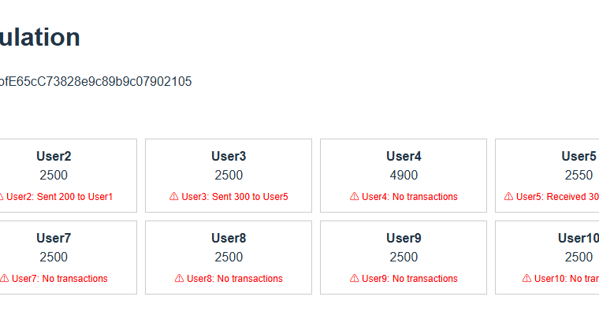

⚠️ License Notice  
This project is protected by copyright. Unauthorized use is strictly prohibited.  
Contact: anioia33@gmail.com

# MetaPayP2P – Web3 Basic Income Simulation with Peer Transfers

🧭 *"Freedom through basic income — made sustainable via smart contracts and AI."*

A circulating basic income simulation with blockchain distribution, AI behavior monitoring, and real-time peer transfers.

---

## 🌍 Why This Matters

**MetaPayP2P** demonstrates a sustainable, self-circulating basic income model —  
one that doesn’t rely on unlimited government funding or taxation.  
By combining immutable blockchain distribution with non-intrusive AI monitoring, MetaPay enables digital economic freedom and scalable public benefit.

---

## 🧪 Simulation Structure

- **Total:** 15 rounds (10 distributions + 5 collection/redistributions)  
- **Time-compressed:** 2 minutes = 1 month  
- Every 2 minutes, the national wallet distributes 500 units to 10 users.  
- After 30 seconds, P2P transfers are allowed for 1 minute.  
- Then data is collected and the next round begins.  

🕒 **Full cycle ≈ 30 minutes**

---

## 📱 Test DApp Details

- A separate frontend is provided for each of the 10 test users.
- MetaMask must be connected to the **Sepolia testnet**.
- Sepolia test ETH is required to cover gas fees.

---

## 🤖 AI Analyze – OpenAI API Integration

This DApp integrates an experimental AI analysis module powered by OpenAI API.

🧩 It processes user behavior and transaction logs to identify economic patterns such as:

- Salary-like repetitive transfers
- Dormant users
- Hoarding or accumulation wallets

🖥️ Example Output:



⚠️ *Note: This feature is passive and never interferes with user autonomy. It only observes and summarizes.*

This is part of our larger goal: exploring **AI-assisted transparency** in digital basic income circulation — without control.

---

## 🧠 AI Philosophy

- Detects abnormal/dormant behavior  
- Suggests optimized logic (e.g., vendor payments)  
- Never enforces, only advises  
- In real-world pilots, AI may give soft recommendations (e.g., overuse of wages), **but autonomy remains 100% with the users**

---

## 📨 Test Participation

To apply, email **anioia33@gmail.com**  
**Subject:** `MetaPayP2P Test Application`  
Include:
- Your Ethereum wallet address  
- Your Web3 experience level  
- Your interest in basic income

---

## 📎 Project Links

- 🌐 **DApp**: https://meta-pay-p2-p.vercel.app  
- 🧠 **Forum**: [CEG Post](https://forum.ceg.vote/t/metapay-a-circulating-basic-income-model-with-digital-currency/5537/34)  
- 🐙 **GitHub**: https://github.com/metapay-creator/MetaPayP2P  
- 🐦 **Twitter**: https://x.com/metapay_creator  
- 🔗 **Smart Contract**: `0xB5912A07Cd6396E1BAE87aCB8EB04B74A1fABCbD`  
- 🎥 **Demo**: [YouTube – Vibe Session](https://youtu.be/zHxQI9oil-0)

---

## 🧰 Tech Stack

- Solidity on Sepolia Testnet  
- React + Vite frontend (with MetaMask)  
- Ethers.js  
- Node.js-based AI behavior simulator (OpenAI-powered)

---

## 🛠️ Local Development (Optional)

```bash
git clone https://github.com/metapay-creator/MetaPayP2P
cd MetaPayP2P
npm install
npm run dev
```

---

## 📂 Project Structure

```
MetaPayP2P/
├── public/
│   ├── ai-banner.png
│   ├── ai-analyze-example.png
│   └── metapay-circulation.png
├── src/
│   ├── App.jsx
│   └── abi.js
├── ai-server/
│   └── server.js
├── README.md
```

---

## 📊 Summary Table

| Feature              | Description                                         |
|----------------------|-----------------------------------------------------|
| National Distribution| 500 tokens every 2 mins to 10 users (simulated)     |
| P2P Transfers        | 1 min transfer window after each distribution       |
| AI Module            | Behavior analysis, dormant detection, suggestions   |
| Smart Contract       | Sepolia testnet (address provided)                  |

---

## 📦 Version

**v1.0.0** – Initial testnet launch with AI-P2P integration

---

## ⚖ License

MIT License  
© 2025 Gyuha Yoon – MetaPay Project for HyperHack
